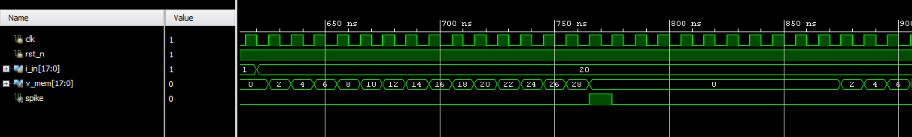

# Leaky Integrate-and-Fire (LIF) Neuron – Verilog RTL

## Overview

This repository implements a Leaky Integrate-and-Fire (LIF) neuron model in Verilog.
The LIF neuron is one of the most widely used models in neuromorphic computing and Spiking Neural Networks (SNNs).

The neuron integrates incoming current over time. When the membrane potential reaches a threshold, the neuron generates a spike and resets.

After generating a spike, the neuron enters a refractory period, during which it temporarily ignores incoming inputs and prevents additional spikes. This behavior models the biological neuron recovery phase and is implemented in hardware using a configurable refractory counter.

This implementation is designed to be hardware-efficient and synthesizable, making it suitable for FPGA and ASIC-based neuromorphic systems.

---

## Neuron Model

The continuous-time LIF neuron model is:

Cm * dVm/dt = I − Vm/Rm

Where:

* Vm → membrane potential
* I → input current
* Cm → membrane capacitance
* Rm → membrane resistance

For digital hardware, the model is approximated in discrete time.

Discrete-time approximation:

Vm_next = Vm + (dt/Cm) * (I − Vm/Rm)

To simplify hardware implementation, the design uses **shift operations instead of division**:

Vm_next = Vm + (I − Vm / 2^LEAK_SHIFT) / 2^TAU_SHIFT

This approach avoids expensive multipliers and dividers, making the design efficient for digital circuits.

---

## Features

* Parameterized datapath width
* Shift-based leak approximation for efficient hardware implementation
* Configurable spike threshold
* Refractory period support
* Membrane potential reset after spike
* Fully synthesizable Verilog RTL
* Functional verification using a testbench

---

## Project Structure

rtl/
Contains the Verilog RTL implementation of the LIF neuron.

tb/
Contains the testbench used for functional verification.

sim/
Contains waveform screenshots from simulation.

---

## Simulation Waveform

The waveform below demonstrates neuron behavior during simulation:

* Membrane potential integrates input current
* When the threshold is reached, a spike is generated
* The neuron resets and enters a refractory period

---

## How to Run Simulation

The design can be simulated using tools such as:

* Vivado Simulator
* ModelSim (please dump the waveform in the testbench)
* Icarus Verilog

Example simulation flow:

1. Compile the RTL file
2. Compile the testbench
3. Run simulation
4. Observe signals:

* clk
* i_in
* v_mem
* spike

---

## Applications

This neuron model can be used as a building block for:

* Spiking Neural Networks (SNNs)
* Neuromorphic processors
* Brain-inspired AI hardware
* Event-driven computing architectures

---

## Author

Sai Ram Lingamsetty
ECE Student – VLSI / Digital Design

---
